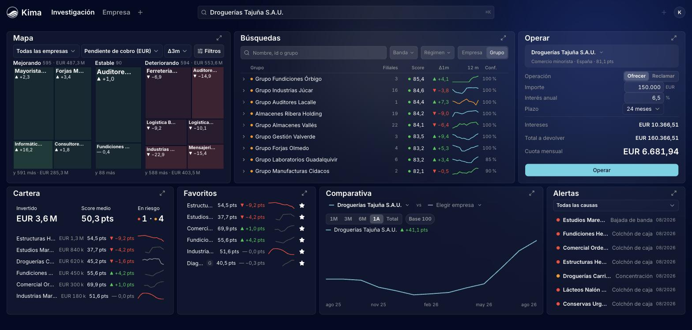
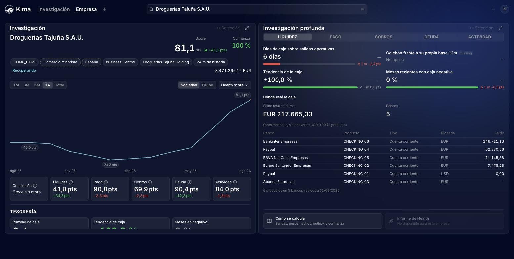
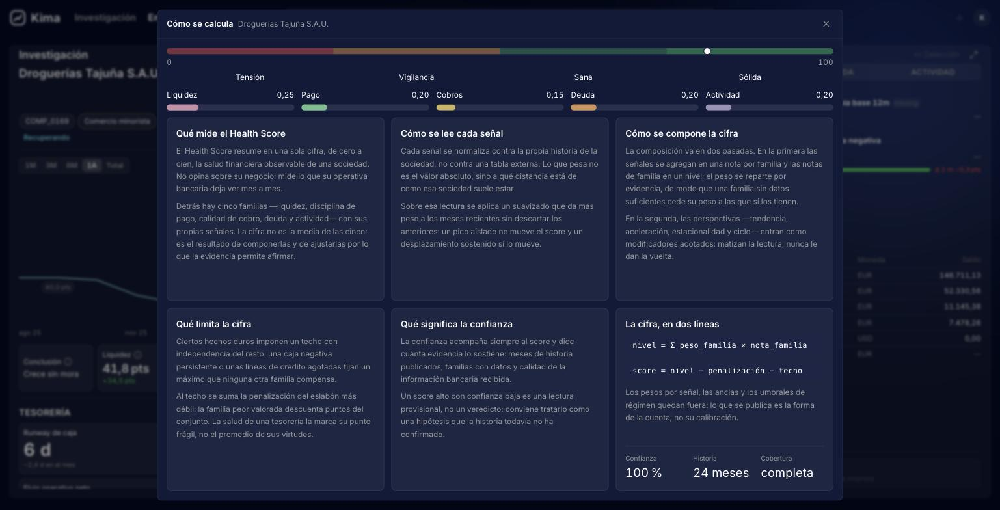
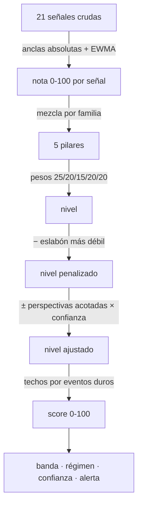
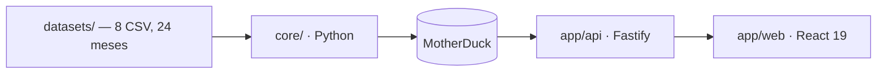

<div align="center">

<picture>
  <source media="(prefers-color-scheme: dark)" srcset="docs/assets/logo-dark.png">
  
</picture>

# Kima

### ¿Puede el dinero decir cómo está una empresa?

Un **score de salud financiera de 0 a 100**, por grupo empresarial y mes a mes, calculado solo con el rastro de tesorería. Y encima del score, la mesa donde un analista decide a quién presta.

[](docs/engine.md)
[](#arquitectura)
[](docs/engine.md)

**Reto de Embat · HackSpain 2026**

🔗 **Demo:** [kima-hackspain.vercel.app](https://kima-hackspain.vercel.app)  ·  📄 [Cómo funciona el motor](docs/engine.md)  ·  🔌 [API](docs/api/v2.md)



</div>

---

## El problema

> En el mes 24 estas dos empresas sacan **tres puntos de diferencia**. Una es mucho mejor riesgo que la otra, y en la foto de hoy no se distingue cuál.
> — brief del reto ([`PROBLEM.md`](PROBLEM.md) §2.2)

Lo que las separa no está en la foto: está en la **trayectoria**. Kima lee el rastro que deja el dinero —movimientos de banco, facturas emitidas y recibidas, comportamiento de pago, coste de financiación y saldos de deuda— y lo convierte en un número que se explica solo.

## Las seis preguntas del reto

| Pregunta | Cómo la contesta Kima |
|---|---|
| **Quién está sano** | Score 0–100 en cuatro bandas, con etiquetas de fortaleza además de las de riesgo |
| **Quién está mejorando** | Régimen `improving` / `recovering`, por magnitud del desplazamiento de nivel |
| **Quién empieza a torcerse** | Régimen `deteriorating` y cinco señales que comparan al grupo **contra su propia base**, no contra la cohorte |
| **Bache o caída** | `blip` y `shock_pending` separados de `deteriorating`: un salto que revierte en dos meses no es un deterioro |
| **Por qué ha cambiado** | Cada capa deja escrito lo que hizo **mientras calcula**; la explicación se monta de ahí, sin LLM, y no puede contradecir al número |
| **Cuándo se vio venir** | Monitor de alertas con causa y severidad, **separado del score** |

## El producto

<table>
<tr>
<td width="50%"></td>
<td width="50%"></td>
</tr>
<tr>
<td><b>La ficha.</b> Score, banda, régimen y confianza; la serie completa; los cinco pilares con su Δ; y la tesorería real detrás de la cifra: runway, bancos, saldos.</td>
<td><b>Cómo se calcula.</b> En prosa, no en fórmulas: qué mide, cómo se lee cada señal, qué limita la cifra y qué significa la confianza. Nadie compra una caja negra para decidir a quién presta.</td>
</tr>
</table>

Encima del score va **la mesa de trabajo**: un lienzo de tableros con diez widgets arrastrables —mapa de cartera, buscador del universo, ficha, grupo, comparativa, favoritos, cartera, alertas— y **«Operar»**, que simula una oferta o una reclamación de deuda sobre una sociedad con cuota francesa y la marca como simulación.

**El comprador es Embat.** Hoy mide el riesgo *de las contrapartes* de su cliente —¿me van a pagar?— pero no el *del cliente mismo* —¿cómo estoy y hacia dónde voy?—. No existe ningún objeto `score` ni `rating` en su API ni en su producto. Kima rellena ese hueco con los ingredientes que Embat ya tiene conectados, y el dataset del reto reproduce exactamente la forma de su cartera real: grupos del mid‑market con varias sociedades, bancos y divisas.

## Cómo funciona el score



Cinco decisiones sostienen el número:

1. **Nada depende de la cohorte cargada.** Anclas y techos son absolutos. Por eso saca el mismo número con 250 grupos en el fichero o con 60 — que es exactamente lo que hace el test oculto.
2. **Un mes nunca mira meses futuros.** Todo es *point‑in‑time*.
3. **Falta de dato no es mala salud.** Lo no observado se encoge hacia 50; nunca se imputa cero.
4. **El eslabón más débil no se compensa.** Un problema serio de caja no se tapa con una facturación impecable.
5. **La alerta de liquidez va aparte del score.** El score ordena y explica; el colchón de caja anticipa. Juntarlas pierde las dos.

El detalle está en **[`docs/engine.md`](docs/engine.md)**.

## Qué da

| | Métrica | Resultado |
|---|---|---|
| **M1** | Anticipación — AUC contra un evento definido fuera del score | 0,742 a 3 m · 0,698 a 6 m |
| **M2** | Estabilidad — Spearman entre meses consecutivos | ρ = 0,923 |
| **M3** | Dispersión — 249 grupos puntuados | mediana 54,4 · σ 16,2 · rango 11–85 |
| **M4** | Paridad entre ramas de cobertura | PSI 0,349 |
| **M5** | Aislamiento — 60 grupos contra el universo entero | idéntico, tol. 1e−9 |

## Arquitectura



El cálculo es **por lotes y está desacoplado del producto**: `core/` no lee ni escribe dentro de `app/`, y la API no recalcula nada — sirve lo que el motor publicó, con su `model_version` y el hash de sus parámetros.

| Capa | Stack | Puerto |
|---|---|---|
| `core/` | Python 3.12 · duckdb · pandas | — |
| `app/api/` | Fastify 5 | 8787 |
| `app/web/` | React 19 · Vite · Tailwind · shadcn/ui | 5173 |

## Arranque

Node ≥ 22 con corepack, Python 3.12 y un `MOTHERDUCK_TOKEN` en `app/api/.env`.

```bash
cd app && corepack pnpm install && corepack pnpm dev    # API 8787 + web 5173
```

Abre **http://localhost:5173**. La API lee de MotherDuck: el frontal funciona sin regenerar nada.

### Despliegue en Vercel

El proyecto `kima-hackspain` sirve la web y la API bajo el mismo dominio, en el plan
Hobby. Su **Root Directory** es `app/api`, con acceso a ficheros externos a esa raíz
activado y Node.js 22. La configuración está en `app/api/vercel.json`.

La build compila `app/web` con `VITE_API_URL=''` y copia sus archivos estáticos a
`app/api/public`. `/api/*` y `/health` llegan a la función `api/index.ts`; las rutas
del navegador, como `/monitor`, tienen fallback a `index.html`.

`MOTHERDUCK_TOKEN` es una variable sensible del entorno **Production** de Vercel.
Nunca se incluye en el frontend ni en Git. La función reutiliza la instancia de
Fastify y usa `/tmp` como HOME para la extensión de MotherDuck.

Desde la raíz del repositorio, con el CLI autenticado:

```bash
vercel link --yes --scope daniel-8494 --project kima-hackspain
vercel deploy --prod --yes
curl --fail https://kima-hackspain.vercel.app/health
curl --fail https://kima-hackspain.vercel.app/api/v2/meta
```

El despliegue se hace por CLI; no hay despliegue automático por cada push.

<details>
<summary>Regenerar el score desde los CSV originales</summary>

El dataset del reto es privado y no viaja en el repositorio. Con `datasets/` en su sitio (o `EMBAT_DATA_ROOT` apuntando a una copia):

```bash
python3 -m venv .venv && .venv/bin/pip install -r requirements.txt
.venv/bin/python core/pipeline_embat.py   # 250 grupos × 24 meses
.venv/bin/python core/enrich.py
.venv/bin/python core/publish.py          # publica en MotherDuck
.venv/bin/python core/evaluate.py         # métricas M1–M4
```

Para el test oculto: `core/pipeline_embat.py --data-root /ruta/al/test --no-cache`.
</details>

## El repositorio

```
core/      el motor, en Python — nada de aquí toca app/
app/       api (Fastify) + web (React) + tools
docs/      cómo funciona el motor, el contrato de la API y el de publicación
```

```bash
cd app && corepack pnpm typecheck && corepack pnpm test   # 553 web · 74 api
cd app && corepack pnpm --filter web build
.venv/bin/python -m pytest core/tests -q                  # 79 del motor
```

---

<div align="center">
<sub>Los datos son sintéticos: ninguna fila corresponde a una empresa, una cuenta o una persona real.</sub>
</div>
