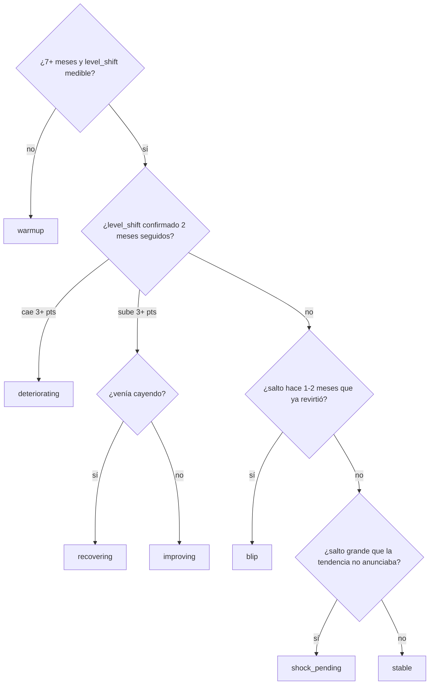

# El motor

`embat-layered-v1` · unidad de análisis: **el grupo empresarial** (250) · 24 meses *point-in-time* · escala 0–100, más alto = más sano.

Describe lo que está implementado. La fuente de verdad es [`core/`](../core/), y todos los parámetros viven en un solo fichero: [`core/engine/config.py`](../core/engine/config.py).

---

## 1. De señales a score

21 señales mensuales por grupo → una nota de 0 a 100 por señal → cinco pilares → un nivel → ajustes → techos.

| Pilar | Peso | Señales |
|---|---|---|
| **Liquidez** | 25 % | `buffer_days` · `neg_cash_share` · `cash_trend` · `buffer_days_z` |
| **Pago** | 20 % | `ap_pct_paid_late` · `ap_days_late` · `ss_regularity` · `tax_regularity` · `ap_days_late_z` |
| **Cobros** | 15 % | `ar_overdue_ratio` · `ar_pct_paid_late` · `collection_ratio` · `ar_overdue_z` |
| **Deuda** | 20 % | `loc_utilisation` · `debt_service_ratio` · `feeint_share` · `feeint_share_z` |
| **Actividad** | 20 % | `op_in_growth` · `inflow_cv` · `net_ocf_ratio` · `op_in_z` |

Cada señal se traduce con **anclas absolutas** —no percentiles de la cohorte— y se suaviza con EWMA. El suavizado va en el pilar, no en el score final, para que la descomposición en drivers siga cuadrando. La definición de cada señal está en [`core/signals/SIGNALS.md`](../core/signals/SIGNALS.md).

```
mezcla       = Σ w_k^eff · P_k                  w_k^eff = w_k / cobertura
Nivel        = encoge_hacia_50(mezcla, cobertura × factor_historia)
Penalización = λ · max(0, τ − min_k P_k)        λ = 0,5 · τ = 45
Score        = min(Nivel − Penalización, techo)
```

**Las señales de desviación (`*_z`)** comparan al grupo con la base que él mismo tenía —mediana y MAD de los 12 meses anteriores—, no con los demás. Existen porque el nivel solo no distingue a un grupo con 15 días de colchón que *siempre* tuvo 15 de otro que venía de 60. Sus anclas son asimétricas a propósito: mantenerse vale 70, deteriorarse cae rápido, mejorar sube poco.

**Los techos** son hechos duros y absolutos: `CAP_NEGCASH` (40) con caja negativa dos meses seguidos, y `CAP_LOCFULL` (60) con la línea de crédito al ≥ 95 %. Van los últimos: un techo corta, no discute con los ajustes.

**Las perspectivas** entran como modificadores acotados en una segunda pasada, escalados por su propia confianza. Dos están activas (`trajectory_pressure` ±8, `network_counterparty_health` ±5) porque solo miran el pasado del propio grupo. Dos están desactivadas (`sector_benchmark_rank`, `data_driven_peer_learning`) porque miran a los demás grupos del fichero: activarlas rompería el aislamiento, que es la garantía del test oculto.

## 2. Bache o caída

Seis regímenes publicables, más `warmup` cuando no hay historia para afirmar nada.



**El régimen se decide por magnitud, no por racha.** `level_shift` es la mediana de los tres últimos meses contra la de los seis anteriores: un mes suelto no lo mueve. Con rachas monótonas, un solo mes bueno las rompía y mandaba a `stable` caídas de más de diez puntos.

`blip` frente a `shock_pending` es la respuesta literal a «bache o caída»: un salto que ya revirtió y cuya mediana aguanta es un bache; uno recién llegado del que todavía no se sabe si revierte queda pendiente. Y un salto que la propia tendencia venía anunciando no es un golpe: es continuación.

Régimen y dirección **nunca se contradicen**; la publicación lo comprueba fila a fila.

## 3. La explicación se escribe mientras se calcula

Cada capa anota lo que hizo en el rastro **durante el cálculo**, no después. Por construcción no puede contradecir al número, y no hay LLM en medio. Salida real para el grupo con mayor caída del universo:

```
score 22,7 · banda stress · régimen deteriorating

"Partimos de un nivel de 45: el pilar más débil (Liquidez y colchón de caja)
 descuenta 19; trayectoria y presión a corto (deteriorándose) resta 3."

  family    liquidity     6,26   (peso 0,25)
  family    payment      76,46   (peso 0,20)
  family    debt         73,20   (peso 0,20)
  family    activity     30,36   (peso 0,20)
  level     blended      44,65   cobertura 0,85
  penalty   weakest_link 25,28   −19,37  ← liquidity 6,26 < τ 45
  modifier  trajectory   22,70    −2,58  ← deteriorating, confianza 0,85
  final     score        22,70           banda stress

  alerta: colchón de caja de 0 días · severidad urgent
```

Además de la frase, cada mes publica drivers ordenados por contribución, con la identidad exacta `score = base + Σ contrib − penalización − techo`.

## 4. Por qué no es un modelo entrenado

El reto no publica etiqueta. La primera pregunta era si se podía fabricar una, y la respuesta medida es que no: **no existe un factor latente de salud en estos datos**.

Se construyeron tres indicadores de tensión de fuentes deliberadamente distintas —caja consolidada negativa, interrupción de pagos recurrentes, y mora alta en facturas a pagar— sobre 1.268 empresas. Aparecen juntos **justo tantas veces como predeciría el azar**: 61 empresas con dos indicadores frente a ~67 esperadas bajo independencia, y 5 con tres frente a ~3,5. Los *lifts* por pares son 0,98 y 0,94, es decir, ninguno.

Entrenar contra cualquiera de ellos habría producido un modelo que reproduce ese indicador, no la salud. De esa evidencia salen dos propiedades del motor:

- **Los pilares son independientes y no compensatorios.** Si las señales fueran colineales sobraría con un factor; como no lo son, cada pilar aporta información propia y castigar el eslabón más débil es lo que corresponde.
- **La ausencia de pagos recurrentes no baja el score.** Cuando un grupo deja de pagar Seguridad Social o deuda, su actividad total cae a 0,47×: eso es el feed bancario quedándose mudo, no una empresa en tensión. Alimenta la cobertura y la confianza, nunca la cifra.

## 5. Cómo se mide

Cinco métricas sin etiqueta, en [`core/evaluate.py`](../core/evaluate.py). Se ejecutan antes y después de cada cambio de fórmula: si una empeora, el cambio no entra.

| | Qué comprueba | Resultado |
|---|---|---|
| **M1** | AUC contra **caja consolidada negativa dos meses seguidos**, un evento definido fuera del score, excluyendo a quien ya está dentro en `t` | 0,742 @3m · 0,698 @6m |
| **M2** | Spearman(rank_t, rank_t−1): un ranking que parpadea es ruido | ρ = 0,923 · mediana \|Δ\| 3,18 |
| **M3** | Un score que no separa, no ordena | 249 grupos · mediana 54,44 · σ 16,21 |
| **M4** | PSI entre la rama con facturas y la rama sin ellas: no premiar el tener ERP | 0,349 |
| **M5** | 60 grupos sueltos dan **exactamente** el mismo score que el universo entero | idéntico, tol. 1e−9 |

**M4 es el número que más margen tiene.** Un PSI de 0,349 dice que las dos ramas de cobertura no puntúan igual. Las mitigaciones implementadas —encogimiento hacia 50 por cobertura, reparto del peso de las señales ausentes, nunca imputar cero— reducen el efecto sin eliminarlo. Eliminarlo del todo exigiría calibrar por rama con referencias congeladas, y eso rompería M5. Entre las dos, la decisión fue conservar M5: es la que garantiza que el test oculto devuelva el mismo número.

M1 y M4 reconstruyen el panel desde los CSV originales, que son privados; sus cifras son las de la última medición. M2, M3 y M5 se verifican desde la salida vigente del motor.

## 6. Publicación

```
pipeline_embat.py → scores_embat.json → enrich.py → publish.py → MotherDuck → /api/v2
```

`enrich.py` no recalcula nada: añade lo que la API publica. `publish.py` sube la publicación de forma transaccional con su `model_version` y el hash de los parámetros, y rechaza la carga si la identidad no cuadra. El contrato de la API está en [`api/v2.md`](api/v2.md).
